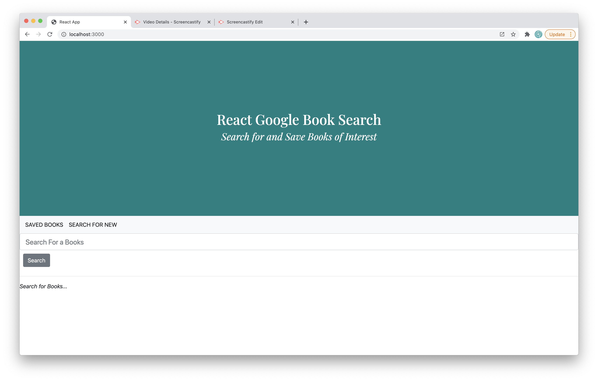
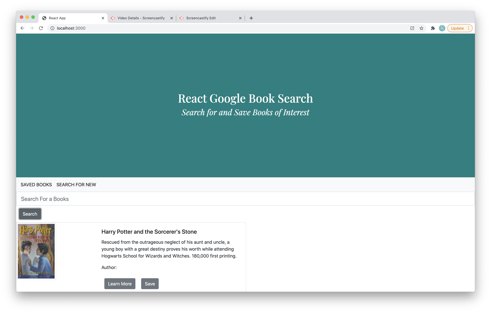

  # Project: React Bassed Google Book Search
  

  # Description: 
  This React-based application allows the user to search for books by utilizing the Google Books API. The user can search by various details, view the book on the Google Book site, and save or delete books from a list they have created. 
  
  # Table of Contents:
  
  * [Title](#Project)
  * [Description](#Description)
  * [Installation](#Installation) 
  * [Usage](#User-Story)
  * [What is Next](#What-is-Next)
  * [What I learned](#What-I-Learned) 
  * [Questions](#Questions)
  * [Useful Links](#Useful-Links)
  
  

  # Installation 
  This is an ReactJS app that uses axios, bootstrap, express, mongoose, and react-router-dom

  # User-Story 
  The user can view this application through the below deployed link. If downloading the repository, please run an npm install and then launch app.

  

  # What is Next 
  Currently the app functions as a search. Next I will work to resolve the issues so that the user can create a save for later list. This is a single page application and is functioning as such, however the books are not saving. Currently the save button is not pulling the correct data and this will be where I begin my next steps. I will need to examine the routes and make sure that I am utilizing them appropriately. 

  # What I learned 
  While working on this assignment, I have gotten a better understanding of React. I feel a lot more confident creating components, pages, and setting up a MERN application. I have also gotten a better understanding of handling submits, changes, usereffect and componentdidmount. 

  

  # Questions 
  Github Username: kecoston If you have any question, you can email me at: kecoston@gmail.com

  # Useful Links

  GitHub Repository: https://github.com/kecoston/book-search
  
  Deployed Link: 
  
  Video of Application: https://drive.google.com/file/d/1bP3Nl3VHajxCFl_yQ2pzHuiVMHeWWhc3/view?usp=sharing

  # Licensing 

   Google Book Search Copyright (C) 2020 kecoston

  
